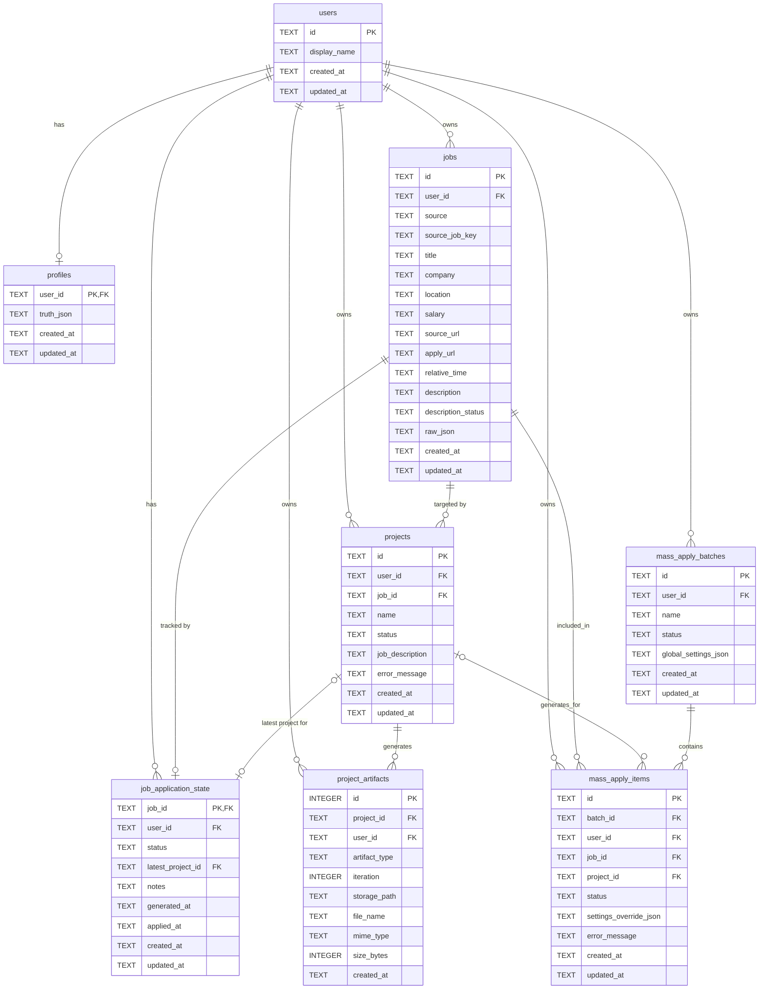

```mermaid
erDiagram
    users {
        TEXT id PK
        TEXT display_name
        TEXT created_at
        TEXT updated_at
    }

    profiles {
        TEXT user_id PK, FK
        TEXT truth_json
        TEXT created_at
        TEXT updated_at
    }

    jobs {
        TEXT id PK
        TEXT user_id FK
        TEXT source
        TEXT source_job_key
        TEXT title
        TEXT company
        TEXT location
        TEXT salary
        TEXT source_url
        TEXT apply_url
        TEXT relative_time
        TEXT description
        TEXT description_status
        TEXT raw_json
        TEXT created_at
        TEXT updated_at
    }

    job_application_state {
        TEXT job_id PK, FK
        TEXT user_id FK
        TEXT status
        TEXT latest_project_id FK
        TEXT notes
        TEXT generated_at
        TEXT applied_at
        TEXT created_at
        TEXT updated_at
    }

    projects {
        TEXT id PK
        TEXT user_id FK
        TEXT job_id FK
        TEXT name
        TEXT status
        TEXT job_description
        TEXT error_message
        TEXT created_at
        TEXT updated_at
    }

    project_artifacts {
        INTEGER id PK
        TEXT project_id FK
        TEXT user_id FK
        TEXT artifact_type
        INTEGER iteration
        TEXT storage_path
        TEXT file_name
        TEXT mime_type
        INTEGER size_bytes
        TEXT created_at
    }

    mass_apply_batches {
        TEXT id PK
        TEXT user_id FK
        TEXT name
        TEXT status
        TEXT global_settings_json
        TEXT created_at
        TEXT updated_at
    }

    mass_apply_items {
        TEXT id PK
        TEXT batch_id FK
        TEXT user_id FK
        TEXT job_id FK
        TEXT project_id FK
        TEXT status
        TEXT settings_override_json
        TEXT error_message
        TEXT created_at
        TEXT updated_at
    }

    %% Relationships
    users ||--o| profiles : has
    users ||--o{ jobs : owns
    users ||--o{ projects : owns
    users ||--o{ project_artifacts : owns
    users ||--o{ job_application_state : has
    users ||--o{ mass_apply_batches : owns
    users ||--o{ mass_apply_items : owns

    jobs ||--o| job_application_state : "tracked by"
    jobs ||--o{ projects : "targeted by"
    jobs ||--o{ mass_apply_items : included_in

    projects ||--o{ project_artifacts : generates
    projects |o--o| job_application_state : "latest project for"
    projects |o--o{ mass_apply_items : generates_for

    mass_apply_batches ||--o{ mass_apply_items : contains
```
